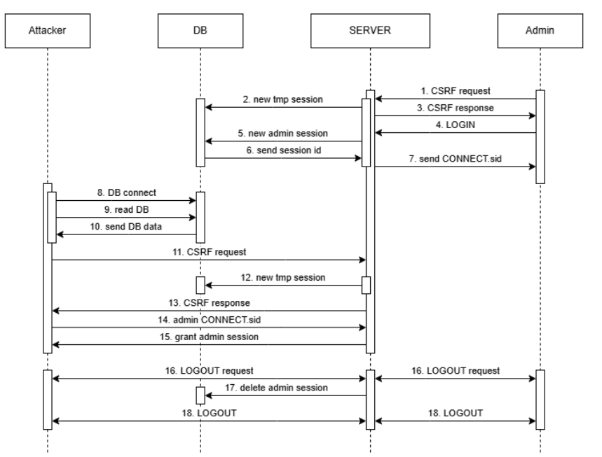

# Penetration Testing on Open5GS

[Canva Presentation](https://www.canva.com/design/DAGjec9O_Qw/sfKtxEG1HWuC7J32zqfn_w/edit?utm_content=DAGjec9O_Qw&utm_campaign=designshare&utm_medium=link2&utm_source=sharebutton)

---

## ✨ Overview
This repository contains the full write‑up, slide deck, and proof‑of‑concept exploit for a privilege‑escalation vulnerability that affects the **Open5GS** core network WebUI.  
By chaining two mis‑configurations — _unauthenticated MongoDB access_ and a _hard‑coded JWT/cookie signing secret_ (`change-me`) — an attacker can impersonate any administrator and obtain complete control of the 5G core via the WebUI.

<p align="center"></p>

---

## 📂 Repository contents
| Path | Description |
|------|-------------|
| `docs/NS_Report.pdf` | 30‑page technical report detailing assumptions, attack flow, database schema, and exploit code analysis |
| `docs/Presentation.pdf` | 20‑slide summary used for the university Network Security project |
| `attack.py` | Python 3 proof‑of‑concept that forges an **admin** `connect.sid` cookie, a matching JWT, and fetches a valid CSRF token |

---

## 🛠  Setup & Requirements
```shell
# Clone
$ git clone https://github.com/contisimone99/Penetration-Testing-on-Open5Gs
$ cd Penetration-Testing-on-Open5Gs

# (Recommended) create a virtual environment
$ python3 -m venv venv && source venv/bin/activate

# Install dependencies
$ pip install -r requirements.txt
# or, manually
$ pip install pymongo pyjwt requests bson
```

### Target prerequisites
* Victim Open5GS deployment with:
  * **MongoDB** exposed on _port 27017_ and **no authentication** (or default credentials)
  * WebUI running with the **default secret** `change-me` (i.e. `JWT_SECRET` / `SESSION_SECRET` **not** overridden)

---

## 🚀 Running the PoC
```shell
# Basic usage – assumes MongoDB on localhost:27017
$ python attack.py

# Specify a remote host / non‑standard port
$ python attack.py --host 10.0.0.42 --port 27018
```
The script will:
1. Enumerate the `accounts` and `sessions` collections.
2. Locate the latest **admin** session.
3. Sign the session‑ID to craft a valid `connect.sid` cookie.
4. Forge a JWT with `roles:["admin"]`.
5. Fetch a CSRF token via `/api/auth/csrf`.
6. Output:
   * `connect.sid` value
   * forged JWT token
   * JSON snippet for `session` **localStorage**

> 💡 **Login tip**: In your browser dev‑tools, paste the _localStorage_ snippet under key `session`, add the `connect.sid` cookie, refresh the page – you are now **admin**.

---

## 🩹 Mitigations
| Recommendation | Rationale |
|----------------|-----------|
| **Change the default secret** (`change-me`) to a long, random value via environment variable | Prevents cookie/JWT forgery |
| **Enable MongoDB authentication** and bind it to `localhost` or a VPN‑only interface | Blocks unauthorised DB reads/modifications |
| Use **short‑lived JWTs** and **rotate session secrets** periodically | Limits impact of compromised tokens |


---

## 📄 License & Disclaimer
This project is released under the [**MIT License**](LICENSE)
The exploit code is provided **solely for educational and research purposes**. **Do _not_ run** it against systems you do not own or have explicit permission to test.

---

## 🙏 Acknowledgements
Developed by **Simone Conti** (GitHub [@contisimone99](https://github.com/contisimone99)), **Nicola Lepore**(GitHub [@NicolaLepore4](https://github.com/NicolaLepore4), **Francesco Copelli**(GitHub [@francescocopelli](https://github.com/francescocopelli)).


